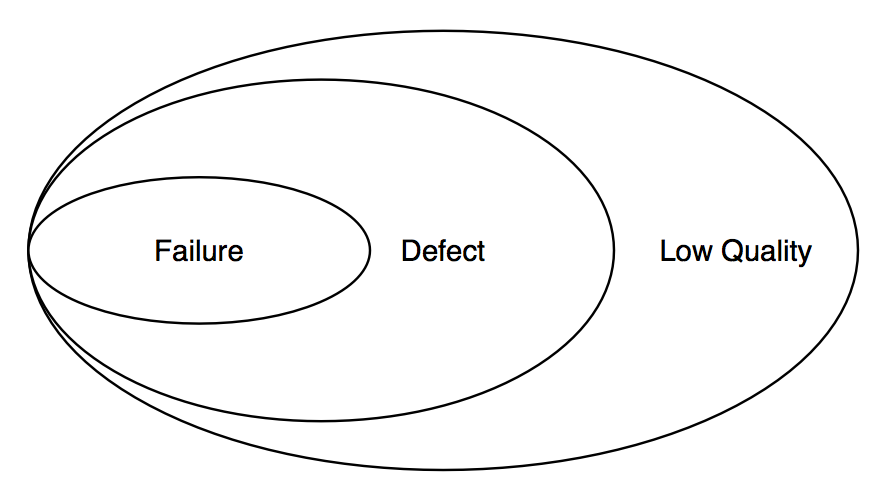
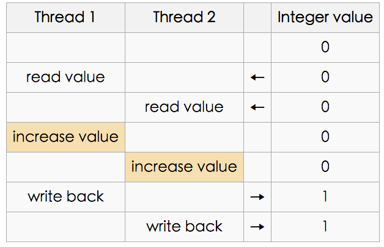
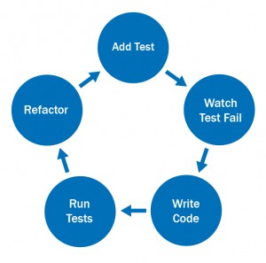

一夥程式設計師正在啟奏當今皇上。「今年有什麼偉大的成就嗎？」皇上問道。

程式設計師私下討論了一會兒，然後回話：「比起去年，我們今年多修正了50% 的Bug」。

皇上滿臉困惑的看著他們。他顯然並不知道「Bug」是什麼。他低聲與宰相商量一會兒，然後轉向這些程式設計師，面露慍色。「你們犯了品質管制不良之罪。明年起不得在有任何的Bug！」他當庭宣下這道聖旨。

當然啦，明年當這夥程式設計師再度向皇上奏報時，就完全不提 Bug 的事了\footnote{取自溫伯格的「軟體管理學」第一卷 系統化思考。

## 臭蟲與錯誤

### 臭蟲

\begin{wrapfigure}[5]{r}{0.18\textwidth}
   \centering
	\includegraphics[width=0.18\textwidth]{img/bug/bug.png}    


1947 年 9 月 9 日下午 3 點 45 分，Grace Murray Hopper 在她的筆記本上記下了史上第一個電腦 bug ——在 Harvard Mark II 電腦裡找到的一隻飛蛾，她把飛蛾貼在日記本上，並寫道「First actual case of bug being found」。這個發現奠定了 Bug 這個詞在電腦世界的地位，變成無數苦逼程式設計師的噩夢。 從那以後，bug 這個詞在電腦世界表示電腦程式中的錯誤或者疏漏，它們會使程式計算出莫名其妙的結果，甚至引起程式的崩潰。Grace Murray Hopper 是Harvard Mark I上第一個專職程式設計師，創造了現代第一個編譯器A-0 系統，以及第一個高級商用電腦程式語言「COBOL」，被譽為「COBOL 之母」，被稱為「不可思議的葛麗絲（Amazing Grace）」。

\begin{figure}[t]
\begin{center}
\includegraphics[width=0.5\columnwidth]{img/intro/FirstBug.png}
FIG: First bug}


這是流傳最廣的關於電腦 bug 的故事，可是歷史的真相是，bug 這個詞早在發明家湯瑪斯·愛迪生的年代就被廣泛用於指機器的故障，這在愛迪生本人的 1870 年左右的筆記裡面也能看得到。而電氣電子工程師學會 IEEE 也將 bug 這一詞的引入歸功於愛迪生 \footnote{Reference: \href{http://technews.tw/2015/12/06/famous-bugs/}{哪些臭名昭彰的軟體 bug 名留青史？。

事實上，口語上常用 Bug, 但光是一個 bug 很難表達所有的狀況。

#### 犯錯、錯誤、失效
當工程師 *犯錯*(error)，把不對的程式邏輯寫到程式碼中，程式碼內就有了*錯誤* (fault），當有 fault 的程式編譯成為執行碼開始執行後，就可能導致系統的 *失效*(failure)。失效不一定要是系統當機，如果和我們預期的結果不同，我們就會說他失效。有錯誤不一定會產生失效，只要程式剛好不會執行到錯誤的地方，就不會產生失效。

> 犯錯（make errors）導致錯誤（fault），錯誤導致失效（failure）。

Fault 錯誤一詞過於通用，在資訊領域比較常用的口頭說法是 `Bug'。但習慣上我們會誤解「Bug」所指的工程師的編碼錯誤，而且也過於淡化錯誤所帶來的影響。許多的錯誤來自於規格或設計錯誤，因此比較精準的說法是 「缺陷」（defect）- 表示系統的錯誤可能來自規格的錯誤、設計的錯誤或是編碼的錯誤。


只有工程師會犯錯嗎？其實不然，我們所採用的編譯器 compiler ，框架frameowork 或 工具也可能出錯，都會造成錯誤的產生。錯誤一定會造成失效嗎？未必，有的程式已經運行了十幾年也沒有發生失效，可以說是運氣好，也可以說是運氣差- 因為越晚發現的錯誤越難修復。

依據 ``IEEE Standard Glossary of Software Engineering Terminology" (standard 610.12, 1990):

> **Error** An error is a mistake, misconception, or misunderstanding on the part of a software developer. 

這裡的 developer 包含 軟體工程師、程式撰寫工程師、系統分析師與測試工程師。例如開發者可能會誤解設計符號、程式撰寫工程師可能打錯一個變數名稱等。

> **Faults** (Defects)
*A *fault} (*defect}) is introduced into the software as the result of an error. It is an anomaly in the software that may cause it to behave incorrectly, and not according to its specification.

錯誤或缺失有時被稱為「bug」。缺失一詞更能凸顯需求規格或是設計文件的錯誤。缺失可以在審查的階段被發現並加以矯正。

%\ifWide \clearpage \fi
**Failures}{
*A *failure} is the *inability} of a software system or component to perform its required functions within specified performance requirements. During execution of a software component or system, a tester, developer, or user observes that it does not produce the expected results. 

所有的失效都因為有 fault 嗎？也不盡然，例如網路的異常造成系統的失效就不能說是系統的錯誤。也就是說例外（exception）會造成系統的失效。但是工程師應該要能夠降低例外所造成的衝擊，例如有訊息的提示，系統狀態的儲存等。

> 關於布林值最棒的一點是，即使你搞錯了，也只差一點點（一個位元，雙關語）。The best thing about a boolean is even if you are wrong, you are only off by a bit. (Anonymous)

### 規格導致的缺陷

並不是所有的錯誤都是因為「寫程式」造成的缺陷，許多的情況規格的問題。針對一個計算機，以下的計算結果或現象是不是錯誤？

- 5/2 = 2
- 1/3 * 3 = 0.999999
- 我需要次方的功能，但卻沒有
- 平方根的功能根本不需要，但系統卻有此功能
- 大數字的相乘，例如 88888888 * 88888888，系統沒有顯示數字。
- 1/0 產生系統崩潰
- 顏色的配色好醜

> 我前方沒有規格，錯誤在我身後形成

考慮以下三個規格：

- *規格一：* 設計一個除法器，使用者可以輸入被除數，除數，並且呈現出結果，小數點下兩位四捨五入。
- *規格二：* 設計一個除法器，使用者可以輸入被除數，除數，並且呈現出結果，小數點下兩位四捨五入。使用者不得輸入被除數為 0。（規格沒有說明萬一輸入0 的處理方式）
- *規格三：* 設計一個除法器，使用者可以輸入被除數，除數，並且呈現出結果，小數點下兩位四捨五入。使用者不得輸入被除數為 0，若輸入為 0, 清除結果欄位，並出現提示要求使用者重新輸入。

很顯然地三個規格比前兩者較好。

> :question: 有一個程式使用者輸入三個數字，並判斷其為何種三角形，請寫出其規格

Hint: 非三角、三角、正三角、等腰三角、等腰直角三角、直角。注意等腰直角三角的判斷條件。

是程式的缺陷？還是顧客的無理取鬧？

「怎麼會有這麼誇張的 bug」, Peter 生氣的說「保單的獲利怎麼會是 0%?」

Ace 耐著性子仔細的了解來龍去脈後說：「這是預設值，預設值都是 0，在保單生效前都是採取預設值。」

「可是那不一樣，客戶的錢都還沒有進來，還沒有造成投資的事實，保單的獲利就不能說是0, 那表示他沒有賺錢，這樣會拉下我們整體的獲利率！」

「上次在系統分析的會議中我們 Kevin 有問你們，你們說ok 的。」

「可是規格書裡面沒有寫，你們就不能這麼寫。」

「可是規格書也沒有不能預設為 0, 這樣我有什麼錯？」Ace 也生氣了！

「拜託，這是 common sense, 在保險業這是 common sense, 你們做這方面的業務連這個都不懂。」\footnote{這是想像的故事和規則，並不代表保險的領域知識。}

（老天，我又不是金保系畢業的，誰知道這鬼東西？）-- Ace 心理想著。

「你們得要在兩天內改完，而且我要扣你們的款」

「兩天！不可能」「那牽涉到很多東西」

「不過是把 0 改成未知，有這麼困難？」

--

如果沒有規格，寫的再好都會被強辭奪理成 bug。同理，明明是錯誤也會被強辭奪理成不是錯誤。

然而，如果一味的要求規格書要寫完整所有的規格，在現實環境也是很困難的。在沒有爭議，一看便能夠確認是錯誤的情況下，我們是可以直接認定為錯誤的。當有模糊不確定的時候，我們再讓規格書來做確認。


FIG: 失效，缺陷與低品質


圖 \ref{img_bug_defect} 說明失效、缺陷和低品質的關係。沒有失效並不代表系統沒有缺陷。沒有缺陷的系統也只是表示符合規格所定義的，規格書很難寫清楚的東西包含 非功能性需求，例如效能、可使用性、可維護性、可重用性等; 程式也可能沒有註解、沒有結構化設計、沒有考慮到容錯等，屬於低品質的軟體設計。

一味的要求使用者必須定義完善的規格，卻不願意再好品質方面好好改善，這也不是一個專業軟體工程所該做的。


> 作為一個專業的軟體工程師，應該探索所有可能的例外; 對於已知的系統限制與例外，都應該進行失效的預防。

### 編碼錯誤

以下列出一些常見的編碼錯誤。
- 算數錯誤
  - 分母為 0 的錯誤; 
  - 運算超載; 
  - 精準度錯誤。 
- 邏輯錯誤
  - 無窮迴圈; 
  - 差一個 Off-by-one bug (OBOB)。%, counting one too many or too few when looping。

```java
for (i = 0; i <= a.length; i++) 
{
    /* Body of the loop */
}
```

- 語法錯誤 Syntax bugs
 
  - 錯誤的運算元，例如把 = 寫成 == 了，前者是指定值，後者是做判斷。

#### 資源相關臭蟲
 
- 使用 Null pointer; 

```java
People p[3] = new People[3];
p[1].sleep();
```

- 使用沒有初始值的變數; 
- 資源漏出 Resource leaks, 有限的空間因為不斷被分配使用（卻沒有釋放），導致資源耗盡所產生的錯誤。See \href{https://en.wikipedia.org/wiki/Resource_leak}{Resource Leak}.
- 緩衝區溢位 Buffer overflow, 程式企圖儲存超過它容量的資料。
- 超量的遞迴，即便是邏輯正確，也會造成堆疊易位溢位。
- 釋放後使用 Use-after-free error, 使用一個 pointer, 它原先所指的空間已經釋放了。


FIG: Race condition in multiple threads


#### 多執行緒程式臭蟲
 
- 死結, 工作 A 必須等到 B 完成才能繼續，但同時 B 也要等到 A 完成才能繼續。
- 競爭, 程式執行的順序與開發者想像的不同，資料的共用沒有有效控制所產生的錯誤

#### 介面臭蟲
 
- 不正確的 API 使用，例如參數個數的錯誤、順序錯誤、資料型態錯誤等。

### 錯誤的預防

錯誤的處理通常有三種方法

- *預防*。預防勝於治療，透過教育訓練或是謹慎的軟體工程工法來避免錯誤的發生。
- *偵測，減緩，容錯與移除*。當錯誤已經進入你的系統，你要在發佈（release）之前把它偵測出來並且解決。
- *處理*。當你的系統已經發佈，錯誤已經發生，你就要考慮發生錯誤的處理。注意一旦含有錯誤的系統發佈給使用者，其處理的代價就會大很多。

預防與偵測有以下的作法：

- *寫程式的模式*。例如採用 Defensive programming 的方式避免邏輯性的程式錯誤。Bug 通常會造成內部資料的不一致。我們寫程式的時候隨時的檢查是否有不一致的情況，發現不一致時可以終止程式的執行或是提供訊息給程式員。


FIG: 寫程式要想著可能會出錯，小心翼翼的


- *正規程式規格* Formal program specification。透過正規程式規格（formal program specification）來精準的描述規格（甚至是數學的表示式），借此避免設計上的錯誤。這種方法很難實施，因為要描述正規程式規格的成本太高。採用一些設計模型，例如 ER diagram, UML diagram 也可以較精準的呈現規格，避免錯誤。

- *測試先行* Test first development。目前，自動化單元測試或是敏捷開發方式都強調測試先行的方法，比較適合目前不明確規格（poorly-specified requirements）的環境中。

- *程式語言支援* 。一些程式語言的設計是比較能預防錯誤的，例如靜態型態（static typed language）與模組化設計。所謂的靜態型態語言就是變數的型態在編譯的階段就知道了，許多錯誤可以提早知道。一些現代的語言也儘量避免使用容易導致錯誤的語言特性，例如 pointer。依據 Moore's law， 電腦變快的速度是很快的，在選擇容易維護與效能之間，我們寧可選擇容易維護。

- *程式碼分析*。就像編譯器一樣會去解析程式碼，但 code analysis 的工具分析其他可能的錯誤，例如：未到程式碼（unreachable code），參數 型態無法對應（parameter type mismatch）等。

- *Instrumentation*。在程式碼中嵌入一些程式碼用來確定程式的正確性或監控其效能。例如在程式碼中加入 PRINT ``hello" 等程式, 或是某一段程式碼的執行時間長度。

- *檢視* Review and inspection。透過檢視來查看文件或程式碼可能的錯誤。

- *根源問題分析* Root cause analysis。長期收集錯誤發生的現象，分析錯誤發生的原因。這是流程改善的一環。

FIG: Test first development



> 程式設計師不喜歡乾隆的第八個兒子，因為八阿哥（bug）

## 除錯

### 觀念

不要想著不會錯，要想著會出錯：
 
- 避免使用試探法，「碰碰運氣修改程式看看能不解決問題」，通常沒有辦法找出問題的根源；
- 錯誤會群聚，如果這個地方有錯，相同的模組、相同的人、相同的時間所開發的程式也該檢查一下；
- 不要只改徵兆，要找出原因，修改原因，動動腦分析思考與錯誤徵兆有關的資訊；
- 小心改一個錯誤又帶來其他錯誤；
- 修改也是一種 programming 活動，所有 programming 的原則都適用；
- 修改前一定要做版本的 check in，中間的過程如果具備意義也要做 check in。
- 除錯的工具只是輔助的手段。工具不能取代思考；
- 避開死胡同。很久都解不開時，可以休息一下，跳脫原思考的彊界。問人家都會有一些新的靈感。

> {
想在自己的程式裡找出一個錯誤是十分困難的。而當你認為你的程式沒有錯誤時，那就更難了。}{It's hard enough to find an error in your code when you're looking for it; it's even harder when you've assumed your code is error-free. (\href{https://en.wikipedia.org/wiki/Steve_McConnell}{Steve McConnel})}
 
\ifWide \clearpage \fi 
測試工程師要擁有偵探的特性：
 
- *好奇心}。對於小問題都好奇的想去解決；
- *耐心}。能夠反覆的搜查，驗證自己的想法；
- *觀察力}。能夠細心的看到、聽到一些現象；
- *學習力}。不斷的學習累積專業知識或生活知識，才能做出判斷；
- *推理能力}。依據現有蒐集的資訊做出推理，再不斷的驗證；
- *經驗}。這是少不了的，很多類似的情節可以馬上判斷出犯人的手法。
- *第六感}。就是覺得哪裡怪怪的。


\begin{figure}[h]
\begin{center}
\includegraphics[width=0.5\columnwidth]{img/bug/detective.jpg}
FIG: 除錯時要秉持著偵探的態度}


        
> 
{Bug 是會害羞的。剛剛還很大方的和我在一起，人一多就躲起來了。

### 方法}

 
- 從錯誤的外部形式入手，找出錯誤的地方。要閱讀錯誤訊息，不要因為是英文就跳過不看。
- 研究程式，找出原因；
- 修改程式，排除錯誤；
- 測試。要注意是否引入新的錯誤；
- 重複上述動作直到沒有錯誤。

\ifWide \clearpage \fi 
研究程式，找出原因的方法：
 
- 強行除錯：watch variable; memory dump; print variable；
- 回朔法：沿著錯誤的症狀，一路辦隨著程式的流程回朔到可能出錯的源頭 ；
- 追蹤法：透過追蹤程式的執行，觀察其路徑與預計的是否相同，找出問題的源頭；
- 注意異常：發現有異常即立即處理，避免異常擴大到無法檢測的地步。（使用斷言）
- 歸納演繹法：根據現象列出所有的假設，在逐步的實驗、分析以否決不對的假設，逐步的縮小可能的假設，找出真正問題的根源。

### 邏輯推演與除錯
除錯的過程中需要從現象找出原因，這需要應用邏輯推演來協助。

\[ p \Rightarrow q  \centernot\Rightarrow q \Rightarrow  p \]

例如我們觀察到 cache 有開的時候，資料就會產生錯誤; 如今資料發生錯誤了，就推斷是開了 cache，這是錯誤的推理，會導致在除錯時一些誤導。也要注意，「不開 cache 就不會產生錯誤」也是一個錯誤的推理：

\[ p \Rightarrow q  \centernot\Rightarrow \neg p \Rightarrow \neg q \]

當多個原因造成一個現象：

\[ p_1 \vee p_2 \vee p_3 \Rightarrow q  \]

表示 $p_1$, $p_2$, $p_3$ 只要其中一個為真，就會造成 $q$ 現象。這也表示當 $q$ 現象沒有發生，$p_1$, $p_2$, $p_3$ 都不可能。亦即：

\[ \neg q \Rightarrow  (\neg p_1 \wedge \neg p_2 \wedge \neg p_3) \]

如果是以 and 連結：

\[ p_1 \wedge p_2 \wedge p_3 \Rightarrow q  \]

表示只有當 $p_1$, $p_2$, $p_3$ 同時滿足時才會造成 $q$, 如果 $q$ 為否，我們可以斷定 $p_1$, $p_2$, $p_3$ 其中一項不可能，也就是：

\[ \neg q \Rightarrow  \neg p_1 \vee \neg p_2 \vee \neg p_3 \]

:question: 已知格式錯誤且住址長度超過50 以上，會產生Err101 的錯誤。以下的推斷是否正確：*``目前沒有產生Err101 錯誤，而且我們確定格式有錯，因此可以斷定字串長度小於 50"}。}

\ifWide \clearpage \fi
*說明：}目前沒有產生Err101 錯誤，表示格式沒有錯誤 或 長度沒有50。因為目前我們確定格式有錯，我們因此可以否定長度超過 50，亦即字串長度小於 50。


:question: 有時候我們需要從一些線索（或現象）來推斷因果。例如，由一些使用者的回報現象如表 \ref{table:LogicDebug}，系統失效可能原因是什麼？}

\begin{table}[h!]
\begin{center}
FIG: 在不同環境下產生的現象}
\csvautotabular{doc/LogicDebug.csv}
\label{table:LogicDebug}

\end{table}

\ifWide \clearpage \fi
我們初步斷定只要是有安裝卡巴防毒軟體（K）並且運行在 Window 10 作業系統時，系統就會產生異常（列印會當掉）。異常的情況與軟體版本、記憶體沒有關係，我們可以獲得此式：

\[ installK \wedge onWindow10 \Rightarrow Abnormal    \]


當然，資料量越多，得到的推論會越正確。但注意若有人反應：系統異常了，而且安裝了 window 10 的版本，是否可以斷定該使用者安裝 K？依據邏輯規則是不一定的，但我們卻常常犯了此錯誤。


%寫小程式時完全不感覺寫程式是困難的，也覺得「軟體品質」和自己沒有關係，但程式一旦大到一定程度，就會難以控制。

## 除錯工具 (lab)

除了理論以外，動手做是很重要的。以下的實作以 Java 為主，工具以 Eclipse 環境為主。測試的工具非常的多，這裡的實驗只是希望大家透過實作了解理論，真正的作業環境還是得看您開發的需求而定。Eclipse  的安裝請參考 \href{http://eclipse.org/downloads/}{\underline{Eclipse download。

以下介紹 Eclipse 的除錯工具

Debug 面板（Debug perspective）是一個可以方便你除錯的面板。包含以下的功能

 
- 中斷點 Breakpoint。Resume 可以讓程式執行在下一個中斷點。
- 看變數 Watch variable，例如觀看 i 目前的值為何。
- 逐步執行 Step by step tracking code。Step into, Step over 可以逐步執行程式碼，前者會進入副程式的內部追蹤程式碼，後者會跳過副程式。
- 看表示式的值 (Expression)，例如 i+j 目前的值。
- 進階中斷點應用。在迴圈中中斷停太多次怎麼辦？透過 Hit count 來跳過許多可能的中斷。當 Hit count 設為 n 時，第 n 次的中斷點程式才會停下來。

\begin{figure}[t]
\begin{center}
\includegraphics[width=0.9\columnwidth]{img/sqa/debug_panel.png}
FIG: Eclipse debug 面板}
\label{fig_junit}


\subsubsection*{Lab demo}

為以下的程式設計一些中斷點，練習

- 如何新增 debug perspective。
- 如何新增、刪除中斷點。
- 如何追蹤程式碼、觀看變數值。
\lstinputlisting[language=Java,caption={Breakpoint Demo1}, label=code:BreakpointDemo]{code/debug/BreakpointDemo1.java} 

\href{https://github.com/nlhsueh/sqa/blob/master/src/debug/BreakpointDemo1.java}{[Get the code]}


%\begin{center}
%\begin{tcolorbox}[title=Variable watch, width=0.9\columnwidth]
%請透過 variable watch 的方法看看 p1, p2 的值的變化。
%```java
%People p1 = new People (12, "John");
%People p2 = p1;
%p1.setAge(30); //觀察 p2 的值是否有變化
%class People {
%   int age;
%   String name;
%}
%```
%\end{tcolorbox}
%

\RefEx{ex:debugger1}

## 防禦性編程 (lab)}


開車遇到綠燈你會直接闖過去嗎？多數的時候我們還是會減慢速度，因為我們不知道對方會不會闖紅燈，這樣的開車方式式一種「防禦性」開車方式。寫程式也有同樣的觀念。防禦性編程（Defensive programming）是一種撰寫程式的態度與方法。

本節介紹兩種技巧：

- \nameref{sec:assertion} 
- \nameref{sec:exception} 

> {一個好的工程師是那種過單行道馬路都要左顧右盼的人}{A good programmer is someone who always looks both ways before crossing a one-way street. (Doug Linder)}

### 斷言}
\label{sec:assertion}

\begin{wrapfigure}{r}{0.22\textwidth}
   \centering
	\includegraphics[width=0.2\textwidth]{img/bug/assertionPoint.png}    


本節介紹的斷言 java assertion 與例外處理都是一種防禦性的編程方法。

%幾乎百分百的確認（斷言; assertion），但在開發階段，我們還是會謹慎一點。

斷言是 java 中用來檢查程式中的假設與斷言。例如你寫一個程式判斷汽車（或火箭）的速度，不管怎麼快，也不可能比光速快。所以你可以下一個斷言：計算出來的速度必定小於光速。當這個斷言被違反了，表示你的程式可能出現問題。

其語法為：

```java 
// assert 後方接判斷句，例如 x>100
assert Expression1; 
```

或

```java 
// 如果沒有滿足錯誤，就顯示 errMessage 訊息
assert Expression1 : errMessage ; 
```

其中 Expression1 是一個 boolean 表示式。errMessage 是一個含有值的表示式，當斷言不成立時，會拋出 java.lang.AssertionError 的例外，並把 errMessage 的值呈現出來。

除此以外，斷言也可以幫助提升程式的可閱讀。如果你不用斷言，你的程式碼可能會出現：

```java
if  (x<0) then
   print("奇怪！");
```

這樣的程式碼，會和原有的程式邏輯攪在一起，降低了可閱讀性，造成維護上的困難。

以下這個範例說明了 assert 的應用，假設我們自己寫一個 square (平方) 的程式，採取防禦性的開發方式每一次計算後就會斷言 a>=0，提昇程式的可靠度。

```java
Scanner sc = new Scanner(System.in);
int a = sc.nextInt();
int b = square(a);
assert (a>=0): "平方後不可能 < 0";
```


#### 斷言的啟動} 為了讓 assertion 不會造成程式的負擔，你可以在編譯的時候決定是否要將 assertion 啟動（enable）。預設是不啟動的。Eclipse 中如何啟動 assertion? 可參考  \href{http://stackoverflow.com/questions/11415160/how-to-enable-the-java-keyword-assert-in-eclipse-program-wise}{此說明}。

\RefEx{ex:assertion1}

> {為你的一段程式碼加上斷言，enable 斷言以查核其正確。待確定程式無誤後，disable 這些斷言

\href{https://github.com/nlhsueh/sqa/blob/master/src/debug/AssertionDemo.java}{[Get the AssertionDemo code]}


#### 什麼時候該用斷言?


- *內部的不變式} Internal Invariants。程式撰寫的過程中，有任何的不變式都可以加上 assertion。

```java
if (i % 3 == 0) {
   ...
} else if (i % 3 == 1) {
   ...
} else {
   // 斷言前面的條件若不滿足，則 i%2 一定會等於 2
   assert i % 3 == 2 : i; 
   ...
}
```

加上這樣的斷言好像沒有作用，但當 i 的值為負數時，你會發現你以為的 2 並不會成真。這就是利用斷言的好處。

- *類別的不變式} Class invariant。類別不變式表示該物件任何方法執行的前後都恆真的式子，例如一個 Stack 物件內部元素的個數一定介於 0 與最大值之間。

```java
private boolean inv() {
    return (num >= 0 && num < capacity);
}
```

所以我們可以在執行任何動作之後呼叫 inv() 來檢查是否發生異常：

```java
push(x);
assert inv();
...
y = pop(x);
assert inv();
```

- *不變的控制流} Control-Flow Invariants。對控制流程的斷言，``我相信絕對不會到 05 行"，因為迴圈內有一定會有一個滿足 if 的條件式。

```java
void foo() { 
   for (...) {
      if (...) return;
   }
   assert false; 
}
```

如此，萬一真的跑到 05, 系統就會拋出例外警告。

- *後置條件} Postconditions。在一段複雜的運算後，你斷定會成為真的事情，用斷言來加強。

```java
sort(SORT.INC); //遞增
if (data.length >=2) assert data[0] <= data[1];
sort(SORT.DEC); //遞減
if (data.length >=2) assert data[0] >= data[1];
```


#### 什麼時候不該使用斷言?}


- *不要使用斷言來做公開方法的參數檢查}。公開方法對參數的檢查本來就應該做，不要用 斷言 來檢查。公開的方法表示會有很多其他人會呼叫此方法，傳入各種不同的參數，為了避免他們傳錯，方法本來就必須測試這些參數，所以不該用斷言的方式來檢查。

例如下面的程式，我們本來就該檢查 grade 是否正確，如果用 assert 來做，當我們 enable assert  時，成績輸入錯就檢查不出來了。

```java
public void addGrade(int grade) {
   assert x <= 100: "grade > 100 error";
   sum + = grade;    
}
```

應該改成下面：
```java
public void addGrade(int grade) {
   if (grade > 100) 
       throw new Exception("grade > 100 error");
   sum + = grade;    
}
```

相反的，若是私有方法，其參數的約定式內部的，我們應該很清楚的知道不該有那樣不正確的參數傳入，所以可以用斷言。如果真的傳入奇怪的參數，就會拋出例外。

- *不要使用斷言來執行程式邏輯相關的操作}。不要把程式該做的工作放在 assert 中。因為 assert 以後可能會被 disable。例如在象棋系統中，某一段邏輯我們棋子移動或是吃子，因為移動或吃子都可能違法，所以他的 return type 是 boolean, 但切記不用 assert 去判斷這些動作：

```java
public void playGame() {
   ...
   assert chess1.move(12);
   ...
   assert chess3.eat(chess1);
   ...
}
```

原因一樣：如果你 disable 了斷言，這些動作就不能執行了。


總言而之，記得這個原則：(1) 開發階段，有斷言，就寫斷言 (2) 如果我們移除了斷言，系統邏輯還是要對的，還是能夠做適當的防呆偵錯。

\RefEx{ex:assertion2}

### 例外處理}
\label{sec:exception}


你不能掌控的事都可能出錯，發生例外。要寫一個穩健（robust）的系統，必須非常的細心，考慮到各種可能的例外情況，各種可能出錯的環境變數，並且做出應對。

Java 中例外的種類：
  
- 需查核例外 checked exception: 你必須處理它（exception handle）或宣告它（讓別人來處理）。 如果你都沒有做，compiler 不會通過，直到你寫出你的*處理碼}。在 Java 中，Exception 下的類別，除了 RuntimeException 以外都是需查核例外。

- 非查核例外 unchecked exception: 通常是程式邏輯的錯誤，例如 NullPointerException, ArrayIndexOutOfBoundsException -- 當發現此例外，你應該修正你的程式，而不是做例外處理，所以這一類的錯誤並不強制去處理。在 Java 中，RuntimeException 下的類別都屬於 非查核例外。

捕捉或宣告原則 Catch or Declare Rule (CDR)：對於例外你只有兩個選擇：一是處理它，二是宣告這個例外讓呼叫者處理。

> {寫一個模組程式和做一件事一樣，一方面你要把事情做好，一方面你要知道如何界定工作範圍 -- 對於你不能處理的事，你得上承給他人處理。

#### 捕捉後處理}

這個程式中我們必須讀取 grade.txt，這是程式邏輯無法控制的事（無法確定執行環境會不會有此檔案），所以有可能產生例外。*FileNotFoundException }是 *Exception} 的子類別，屬於 需查核例外，我們的處理方式就是呈現訊息，並且跳離系統。

```java
static void openFile() {
   try {
      FileInputStream f = new FileInputStream("grade.txt");
   } catch (FileNotFoundException e) {
      System.out.println("File does not exist");
      e.printStackTrace();
    }
}
```

%\lstinputlisting[language=Java,caption={Breakpoint Demo}, label=code:BreakpointDemo]{\codePath/debug/BreakpointDemo.java} 

\href{https://github.com/nlhsueh/sqa/blob/master/src/debug/ExceptionDemo1.java}{[Get the code]}

#### 捕捉再拋出}

下述的程式中我們的處理方式是重新拋出該例外。請注意第 1 行的 throws 有加上 s, 第 5 行的則沒有。在宣告區的 throws 是有加上 s 的。

```java 
static void openFile3() throws FileNotFoundException {
   try {
      FileInputStream f = new FileInputStream("grade.txt");
   } catch (FileNotFoundException e) {
      System.out.println("File does not exist");
      // re-throw the exception
      throw new FileNotFoundException();
   }
}
```

#### 自己的例外自己定義}

```java
static double getGradeAverage(int g[]) throws WrongGradeException {
    int sum = 0;
    for (int i = 0; i < g.length; i++) {
        if (g[i] > 100 || g[i] < 0) {
            throw new WrongGradeException(g[i]);
        }
        sum += g[i];
    }
    return sum / (double) (g.length);
}

// 自己定義的例外，裡面還封裝了成績分數
class WrongGradeException extends Exception {
    int wrongGrade;
    public WrongGradeException(int grade) {
        super("The grade is wrong, maybe > 100 or < 0");    
        this.wrongGrade = grade;
    }    
    public int getGrade() { 
       return wrongGrade; 
    }
}
```

完整的程式可參考 \href{https://github.com/nlhsueh/sqa/blob/master/src/debug/ExceptionDemo.java}{ExceptionDemo}.

> {把「例外」視為「常態」是專業工程師必備的態度。

\RefEx{ex:exception1}

## 缺陷的管理}


### 大樓的燈}
\label{Story:FloorLight}

「26 樓會議室的燈亮著。應該關掉吧。」bug 的備註裡寫道「請 5 分鐘內搞定，只要按一下開關就好了。」\footnote{取自 \href{http://www.reddit.com/r/ProgrammerHumor/comments/2spd2s/when_someone_gives_you_a_bug_long}{reddit: When someone gives you a bug。

我去了 26 樓的會議室。燈的確亮著，但房間裡沒有燈的開關。

所以，我需要安裝一個開關。但設計師說，它會破壞房間的美感。另外，牆壁是混凝土。你需要合適的工具才能安裝開關。但是，沒有人會批准購買這些工具。如果沒有合適的工具，安裝開關將需要兩天。他們希望你現在就能把燈關上，因為他們害怕 長官可能心血來潮決定去 26 樓逛逛，並恰好路過了會議室，問為什麼燈是亮著的。

現在我不斷地收到郵件，詢問為什麼會議室的燈還是亮著的。我不得不群組信件說明情況 -- 於是開始了一個恐慌的電子郵件鏈。

我了解，只發信件而不實際做點什麼，這個問題永遠也不會被解決。bug 系統裡，這個 bug 歸你處理，而且它的最後期限就是今天。如果問題沒有解決，會有麻煩的是你。所以，我設法進到了 26 樓走廊的天花板裡，找到了會議室燈的電線，一刀切斷。問題解決了。

為了平息在電子郵件鏈裡的恐慌，我再次群發郵件說明了我是如何解決問題的。

郵箱安靜了一陣。但一會兒又開始熱鬧了起來：每個人都在擔心，現在會議室的燈無法開啟和關閉，如果長官想在那裡開會怎麼辦？因此，他們要求我「把燈的電線接到地下室去」。如果有人需要開關燈時，他們會通知我到地下室去，連接或斷開電線。

這實在太荒謬了，我不能接受。但我的老闆說，「*我知道這不太好。但它是現在唯一的解決方案}」。

這時，我面臨著抉擇。我可以照著他們說的做，或者辭職以示抗議，另謀高就。

但你知道，一旦辭職開始了新的工作，新的「他們」很可能也會要求我做這麼白痴的事，如果不是更白痴的話。

我把 26 樓的電線接到了地下室。當我進入地下室後，發現已經有幾十條電線掛在牆上。我才知道我並不孤單，也這才知道了這個白痴想法是從哪來的。我調整好了電線，依樣畫葫蘆的貼上標記，默默地向下一個可能處理它的夥伴們道歉。

終於，我回到了我的辦公桌，打開電腦，卻收到了一個新的回報。QA 重新開啟了 bug。bug 描述裡說「房間還是亮著。」

我回到 26 樓的會議室。燈是滅著的。我返回辦公桌，關閉了 bug，並註記「我已經親自檢查過了」。

QA 再次重新開啟了 bug。「房間還亮著」bug 描述裡堅持。再次親眼確認燈泡滅著後，我將情況匯報給了上司。他建議我去地下室檢查電線。我抗議的說我正直盯盯地看著燈，它就是滅著的。 「我知道，但去檢查一下。這樣一來你就可以告訴 QA 你確認了所有流程。」

我嘆了口氣，前往地下室。果然，電線沒有連接，切口兩端都好好地被包裹著。電燈不可能是亮著的。

我向 QA 反應，我已經檢查了電線，它們沒有連接著，我正看著燈泡，它是確確實實關著的。

「我不是指燈泡，」QA 說。 「我所說的 bug 是房間裡的光。現在還是亮亮的，房間現在仍然不夠暗。你應該拉下百葉窗」。老天，這是什麼問題？「*百葉窗不歸我管，bug 描述的是``燈"光。}」

QA 不相信我，他發出一組電子郵件，詢問 bug 是否包含百葉窗拉下的問題。

我等了一會兒，「叮」一聲，有信件來了。

「從理論上說，」他們問，「如果光太亮或太暗的話，在會議室開會的人能自由拉上或拉下百葉窗嗎？」

「是的，他們可以」，我回覆。「任何一個普通人都能做到。」

「太好了。那麼，燈光問題暫時到此為止。我會安排如何處理百葉窗的會議」。

bug 終於被關閉了。但來來回回的信件往返中已經驚動了長官們，他們希望在那裡開會討論一下。

我到地下室，連上電線，並返回辦公室。一坐下就發現我的信箱又多了 32 個新的消息。 「出問題了- 燈還是熄滅的!」「有個問題- 沒有燈光!」 「你收到我們發的郵件了嗎」「馬上來解決！快」！等等等等。

第 32 封郵件說道:「沒事- 燈亮了。」

如果要說有什麼好消息的話，那就是在會議結束後，大家甚至都忘記了 26 樓有個會議室，我也不需要對它做任何處理。

:question: 這個故事有哪些隱喻？}

### Lala 語錄}

為大虎保險公司開發的保險系統已經有一年，許多模組陸續上線測試，也頻頻出現問題，大虎的專案經理「福哥」似乎已經按捺不住，找雄太反應：

「雄太，系統有問題沒有關係」福哥說：「但是要處理，處理的態度也很重要」

「難道，Lala 處理的不好？」雄太說。

「她的回應感覺起來是不認錯，好像在推責任，難道我們還會污賴她嗎？最糟糕的是，今天講了這個錯誤，下星期測試又冒出來，真懷疑她到底有沒記下來？有沒有認真在除錯？你看看，這是員工們私下整理 lala 常常說的話」：

\begin{center}
%\begin{tcolorbox}[floatplacement=t, breakable, width=.85\columnwidth, title=Lala語錄]
```

- 之前不會這樣啊！
- 昨天明明會動的啊！（皺眉頭）
- 這一定是你們機器的問題。
- 你剛剛到底做了什麼！（生氣狀）
- 一定是你的資料有問題。（鐵口直斷）
- 我已經好幾個禮拜沒碰那一段程式了，你們有沒有改什麼？（委屈狀）
- 你一定是用到舊版了。
- 巧合吧！為什麼這種壞運氣只讓你碰上，我用都沒問題。（攤手）
- 我不可能什麼功能都測試到吧，有 bug 是正常的！（要不然你要怎樣！）
- 這程式應該是會動的，只是我寫好後還沒時間測試，阿你們就一直要阿。
- 可惡！一定有人改了我的程式。（眼神飄移）
- 你有檢查過你的電腦有沒有病毒嗎？（都是你的錯）
- 在你的系統不能用那一個版本的程式啦！
- 你幹嘛要那樣操作，你要先這樣這樣那樣那樣阿。
- 程式發生問題時你在哪裡？（摸下巴）
- 在我的機器明明就可以動啊！
%- 儘管這功能還不能動啦，你覺得他如何？
               
%\end{tcolorbox}
```


「哈哈，好有趣的語錄。哎呀，Lala 也只是發發牢騷，她會處理的，沒有那麼糟糕」孟老覺得福哥有點借題發揮。「但我一直覺得我們應該有錯誤追蹤的系統，這樣三方人員都可以看得到錯誤，減少誤會」。

「三方？哪三方？」雄太問

「Lala 可以看到有哪些錯誤是需要處理的，還有其優先順序; 福哥也可以看到哪些問題在處理中、哪些已經處理完畢、哪些還沒有排進來處理; 我們也可以隨時從管理者的角度看到系統目前有多少錯誤，透過這樣了解系統的穩定度」孟老說，「這一類的系統通常叫做錯誤追蹤系統（bug tracking system）或議題管理系統（issue management system）」

雄太聽了覺得不錯，福哥也頻頻點頭說：「沒錯，我們要有一個這樣的系統」

「可是...」阿鐸有點擔心的說：「應該有誰來提問題？Lala, 福哥還是其他專案人員？難道所有提的問題都真的是問題嗎？有些時候是你們誤解系統了，那些所謂的錯誤...」

「的確，權限的管理與人員的設定很重要」孟老打斷阿鐸的話說「還需要有一個審核的人，確定是問題後才會委派處理單，這樣可以降低 Lala 的負擔。簡單的說，我們需要定一個 IMS 的處理流程」。

＊＊

Lala 被告知要採用 BTS， 一開始有不被信任的感覺，而且每個錯誤都被真真切切的記錄下來，想賴也賴不掉。好處是：她寫程式可以專心些，不會被忽然緊急的電話打斷，二來是雄太和福哥也完整的知道她在處理哪些問題，處理的詳細情況都記錄在上面，不必一直重複的解釋。


### 議題管理系統}
\label{sec:bugMgmt}

:question: 市面上有哪些常用的 BTS/IMS？有哪些功能？IMS 的流程為何？}

發生缺陷並不嚴重，嚴重是去處理錯誤，沒有一套缺陷處理的機制。

缺陷追蹤系統，有時候又叫議題追蹤系統（issue tracking system）是一套管理缺陷或議題的資訊系統。他可以協助客戶通報缺陷，程式員知道要修正哪些缺陷，並且讓品質確保人員掌握缺陷的現況\footnote{\href{http://www.bugtrackingtools.net/}{From: http://www.bugtrackingtools.net/。一般的缺陷管理系統包含以下資訊：


- *Status and Resolution}: bug 目前的狀態，例如：已確認、已指派、已修復、已查核、已解決等。%These define exactly what state the bug is in - from not even being confirmed as a bug, through to being fixed and the fix confirmed by Quality Assurance.
- *Assigned To}: 由誰負責修復錯誤。%The person responsible for fixing the bug.
- *Bug Location}: Bug 的畫面或是相連接的 URL。The screen or the URL associated with the bug, if any.
- *Platform and OS}: 產生 Bug 的機器環境的作業系統。%These indicate the computing environment where the bug was found.
- *Version}: Bug 所在的產品版本。因為一個系統會有很多版本，使用者回報錯誤時應該說明是哪個版本。%The ``Version" field is usually used for versions of a product that have been released.
- *Priority}: 重要性。修復錯誤時會已重要的先修復。%The bug assignee uses this field to prioritize his or her bugs. It's a good idea not to change this on other people's bugs.
- *Severity}: 嚴重性，說明此錯誤所造成的影響嚴重性。%This indicates how severe the problem is - from blocker (``application unusable") to trivial (``minor cosmetic issue"). You can also use this field to indicate whether a bug is an enhancement request.

BTS 主要的功能如下：

- 建立專案、使用者及其管理，定義缺陷的生命週期、生命週期的管理、角色與權限的定義與管理。 
- 缺陷的指定、分類與指派。% bug definition, classification and assignment; 
- 缺陷的文件，包含畫面快取、影片、文字與聲音等管理。%bug documentation (screenshots, video, text document) management; 
- 以 email 自動化通知，例如當缺陷的狀態改變時。
- 缺陷與議題改變的過程記錄（change history）。
- 與版本管理系統的整合。例如缺陷出現在哪一個版本，被修復在哪一次的 commit。
- 與測試管理系統整合。
- 與 office 軟體（或是 wiki）系統整合，提供專案文件的功能，也可以搜尋與報告。

比較知名的工具例如：\href{https://www.bugzilla.org/}{Bugzilla}, \href{http://www.redmine.org/}{Redmine}, \href{https://www.mantisbt.org/}{MantisBT} 與 \href{https://trac.edgewall.org/}{Trac}.

\RefEx{ex:BTS}

\myquote{\JokeIcon}{\href{http://skillprogramming.com/top-rated/bugs-will-be-fixed-in-20-stay-up-tuned-guys-1891}{Version 1 product
{}


%\clearpage

\ifWide 
\begin{figure}[t]
\begin{center}
\includegraphics[width=0.6\textwidth]{img/bug/bzLifecycle.png} 
FIG: Defect Management Lifecycle}
\label{fig:DefectLifeCycle}


\fi


\ifBook 
\begin{figure}[t]
\begin{center}
\includegraphics[width=0.8\textwidth]{img/bug/bzLifecycle.png} 
FIG: Defect Management Lifecycle}
\label{fig:DefectLifeCycle}


\fi

\ifTBook 
\begin{figure*}[t]
\begin{center}
\includegraphics[width=0.8\textwidth]{img/bug/bzLifecycle.png} 
FIG: Defect Management Lifecycle}
\label{fig:DefectLifeCycle}

\end{figure*}
\fi


\clearpage


\begin{comment}
## 案例}

### 兩千萬的系統掛了！}
\label{Story:NoClearData}

\BearIcon「這是國外 No.1. 的保險投資系統，大虎公司決定花兩千萬導入」雄太興奮的說「我們拿到這個案子了，每年的維護費有兩百萬」。

「除了介面好，功能強以外，它還詳盡的紀錄每一個使用者進到網站後的每一個行為，作為行為分析，幫助我們做更好的服務」雄太有劈哩啪啦的講了一大堆，最後轉頭向 Jason 好好督導這個案子」。Jason 連忙說是。

教育訓練安排在靠近台北火車站的教育訓練中心，幾乎全台灣有買此系統的工程師都一起訓練。Jason 被指定管理這套系統，但上課第一天他心就冷了... 

「居然是外國講師...」一開始他還很仔細的聽，但慢慢的眼皮救越來越沈重了。還好是在電腦教室有系統可以操作，因為是多國語言，所以很容易上手，操作的幾次以後，他的信心來了「其實很簡單，自己玩一玩就知道了」，看著厚厚一本的英文維護手冊，「明天不帶了」。

一個月後系統上線，半年來一切運作正常，功能超強的系統也為公司爭取到不少的投資型保單。大虎的江老闆高興的說：「這套系統買的真值得」。

企劃部規劃半年的「美金超值保單」正式上線，第一天就造成熱潮，訂單是以往了兩倍，但是第二天上午10:02, 正值上線人數高潮的時候，

「鈴...鈴...」Jason 的電話開始響的不停，「怎麼搞的？系統掛了？客戶都說連不進來？」

做了檢查，網路正常的，CPU 的使用率也正常，memory 也只使用了10%，資料庫也正常，其他的系統也正常，就這個系統掛了。

Jason 只好把 process kill 掉，系統重新啟動，阿彌陀佛，希望開的起來... 但卻出現了這個訊息 「xxxxx, 系統無法開啟」，Jason 忽然對講師的再三提醒有了印象...

＊＊

Jason 可能做錯了什麼？%\BBFB


\end{comment}


%## 說明}
%在 Section \ref{Story:NoClearData} 中所提到的故事，可能的原因是：系統的 log 已經滿了，沒有定期清除，造成系統無法正常運作。作為系統營運人員要時時的注意系統的狀況，不只是 CPU, memory, network, log 所佔據的磁碟空間也是要注意的地方。可以在一開始使用的情況下觀察用量，推估磁碟滿的時間的，或是每月/每週定期的觀看。
%
%在 Section \ref{Story:InputData} 中，顯然有新舊兩個系統同時在線上，業務部的同仁可能大部分都用了新系統（因為大家彼此詢問功能如何操作），而公司其他部門採用舊系統。新舊系統在修改撰寫時「程式邏輯」必須撰寫兩次，很容易造成差異。系統開發時應該避免有重複，無法避免時，需要謹慎測試。
%
%在 Section \ref{Story:DrawPrize} 詭異的尾牙抽獎中，有可能是DB 根本沒有更新，去年抽完獎以後這個功能舊不用了，擺了一年當然有可能沒跟新，同時，大為剛開始接手這個系統，刷卡名單也可能 copy 到錯誤的目錄。如此一來，就有可能抽到去年的同仁。


%### 我們都輸入了}
%\label{Story:InputData}
%
%「聽說老總規定我們組的今年一定要去填系統的使用意見」
%
%「是阿，過去我們這一組填寫率最低，被盯上了」
%
%「共有30 題ㄟ，看的眼都花了，最不喜歡填寫意見回饋了」
%
%「這也沒辦法，看完考績後就有按鈕可以立即點擊進入填寫。如果忘了，可以在舊系統選單中找到填寫的功能，別忘了」
%
%＊＊
%
%「我們明明都填了」業務部的一群人不高興的反應著。因為祕書處統計大家的回饋意見時，發現業務部只有一個同仁填寫，其餘 20 個都沒有。其他的單位也大多有填寫。
%
%工程師一派輕鬆的樣子，「可是其他單位的的都有阿，而且... 你們單位也有人填寫阿，系統是正常的」
%
%勉強填寫最不喜歡的問卷已經是一肚子火了，聽到這樣的「指控」，業務部的大砲忍不住的說「我已經填寫了，再怎麼說老子也不再填寫！」
%
%業務部經理也是一肚子火，他也認定系統有問題，但也知道業務部的許多同仁對於電腦操作特別不習慣，他彆扭的說「Lala，怎麼辦？」
%
%＊＊
%
%你覺得可能的原因是什麼？如何改善？

%### 越修越多的 Bug}

% \fi %ifnoEx

## 練習


### 錯誤}

- 以下何者正確
	
	- 只要程式的邏輯沒有出錯，就是一個沒有缺陷的系統。
	- 身為一個專業的軟體工程師，系統必須符合規格書的要求，規格書以外的東西則不需要理會。
	- 軟體只有執行後才能測試，也因此沒有足夠的時間除錯。
	- 系統有 fault, 就一定會有 failure
	- 制定規格、軟體設計、軟體實作都可能是錯誤的來源，其中軟體實作是錯誤的最大根源。
	

%
%- 下列何者為 編碼錯誤、缺陷、品質不良？ 
%	
%	- 規格雖沒有定義效能，但系統慢得很誇張，功能也始終是對的。 
%	- 導航系統因為天候不佳 GPS 無法精準定位而出現位置的偏差。 
%	- 「台中等公車App」因為台中市政府的伺服器出現故障而無法正確顯示公車位置。
%	- 系統符合規格，使用者也很滿意，但難以維護。
%	- 系統符合規格，但沒有防呆設計，年齡欄位可以輸入負數。
%	- 只要伺服器每個星期重新開機就不會出錯。 
%	- 系統因為安裝設定的錯誤導致功能的異常。 
%	- 只要記得先匯入成績單，系統操作就會正常，否則會計算錯誤。 
%	- 有安全性的漏洞。 
%	- 雖然能夠符合功能規格，但系統每天晚上都重新開機才會正常。
%	- 雖然能夠符合功能規格，但操作很困難。
%	- 不需參考規格書，也可以發現系統的許多功能是錯誤的。
%	- 執行後系統當機（crash）。
%	- 功能運作正常，但不符合規格書要求。
%%	- 功能運作正常，符合規格書要求，但對許多限制沒有進行防錯處理。
%	

- 2017/1/10 台灣證券交易所發生「大立光熔斷」事件，請說明此錯誤之原因。
	
### 除錯工具}

- Eclipse debug 工具中，應用哪些方式來協助偵查錯誤？

- \label{ex:debugger1} 應用 Eclipse 除錯工具，針對以下程式進行除錯：\href{https://github.com/nlhsueh/sqa/blob/master/src/debug/BubbleSort.java}{\underline{BubbleSort.java

- \label{ex:debugger2}應用迴圈來寫一個程式計算 $sin(x)$,其中 $x$ 為一個徑度。30 度等於 $30*PI/180$ 徑度, 例如 $sin(30’) = sin(pi/6) = sin(3.14159/6)$ 約等於 $0.5$。使用 debug 的工具來協助你撰寫此程式。$sin(x)$ 的公式如下, 迴圈跑的越多次值會越精準, 請設定迴圈內的執行次數為 10，並印出結果。

\[ sin(x) = x - (x^3/3!) + (x^5/5!) - (x^7/7!) + ... \]

- \label{ex:debugger3} 承上題，一開始迴圈只跑 3, 每次增加 2 個，一直到相鄰的兩次`新增迴圈'所得到的值小於 $0.00001$。請利用 Debugger 的各種 view 來協助擬進行此程式。或使用這個 \href{https://github.com/nlhsueh/sqa/blob/master/src/debug/Sin.java}{\underline{Sin.java 來除錯。

- 追蹤程式時，step into 和 step over 有何差異？

- 以下程式，當我們把 breakpoint 設在第 2 行時，variable 的視窗呈現 a 的值是多少？(1) 100 (2) 101

```java
int a = 100;
a = a + 1;
```

- 某病毒在 13 號星期五或聖誕節一定會發作，以下何者為真
	
	- 今天沒有發作且今天不是聖誕節，則今天一定是 13 號
	- 今天 1/13 沒有發作，那們今天一定是星期五
	- 今天是聖誕耶，一定會發作
	- 今天不是 13 號也不是星期五，一定不會發作
	
### 斷言 \RefSec{sec:assertion
- 以下何者正確？
	
	- 斷言可以在編譯被 disable。
	- assert false; 是錯誤的語法。
	- assert a>100: 100; 是錯誤的語法。
	- 應該多利用斷言來取代程式邏輯的判斷，可以兼具錯誤管理的功能。
	- 斷言不該應用於公開方法的前置條件的檢查。
	
	
- 以下何者正確：
		
	- 斷言不應用於公開方法的前置條件的檢查 
	-  JUnit 中 @Before 的目的在於配置每次測試所需要的環境或資源 
	- 斷言可以在 compiler 時透過參數取消 
	-  @End 是在所有的測試案例結束後會執行的程式，目的是回復被變異的程式碼。
		 
	
- 利用斷言與透過 if condition 來檢查有和不同？

- 說明斷言使用的時機。

- 承練習 \ref{ex:debugger3}，請應用 assert 的觀念在 sin() 的計算上。

- \label{ex:assertion1} 程式 \ref{code:BreakpointDemo} 有許多錯誤，我們如何加上 assert 幫助我們程式除錯？請改寫此程式。

- \label{ex:assertion2} 學期成績由期中考、期末考、平成成績所組成，各佔 30%, 30%, 40%。計算出的成績應該小於等於 100 分，請用斷言來確保最後成績的正確 (Hint: double getGrade(int mid, int final, int general)。

- \label{ex:assertion3} *int checkTriangle(int a, int b, int c)} 會判斷是何種三角形（是三角形、正三角形、等腰三角形），其中 a, b, c 是三邊的長。此程式何處可應用到 assertion? 何處不該用 assertion。

- \label{ex:assertion4} 有一個 Tree 類別，一個 Node 類別。node1.add(node2) 可以把 node2 加到 node 的子節點。 tree.setRoot(node1) 可以設定 node1 為根節點。每個 node 內有一個數值，tree.getSum() 會傳回所有 node 的合。node.getSum() 會回傳該點和所有子節點的合。應用 assert 來寫這個程式。設計一些測試案例來測試此程式。(Hint: tree 不可以有 cyclic 的情形發生)

### 例外處理 \RefSec{sec:exception

- \label{ex:exception1} 寫一個程式會由出生年月計算一個人的大約的年齡。如果遇到出生年月異常的（int, int）-- 這是你無法處理的狀況 -- 請拋出一例外給上層。請宣告此例外，並撰寫測試程式。

- \label{ex:exception2} 延續 Ex \ref{ex:assertion1}，當輸入的三邊長（a,b,c）長度 <= 0 時，應該拋出例外，該怎麼寫？

 - \label{ex:exception3} 同上，如果我們特別設計一個例外類別 TriangleException，裡面封裝三個邊的長，請改寫此程式。

### 缺陷管理}

- \label{ex:BTS} 請討論圖 \ref{fig:DefectLifeCycle} 的缺陷管理的流程，你認為一個缺陷的生命週期為何? 

- 請安裝一個 Bug Tracking System, 並透過執行了解其功能。

%-  \label{ex:StoryLight} :speech_balloon: 在 \ref{Story:FloorLight} 中透過大樓的燈引用錯誤的發生與處理，請說明其隱喻。

- :speech_balloon: 在本章的引文中，皇上對於 bug 的處理似乎不太滿意。這個小故事有何隱喻？

%### 綜合}
%
%- 在 \ref{Story:DrawPrize} 的尾牙抽獎系統中，可能的原因是什麼？如何改善？


參考解答：大樓的燈（\ref{Story:FloorLight}）有哪些隱喻？

- 「疊床架屋」、「治標不治本」的方式來處理問題往往在日後會造成更大的問題。
- 錯誤產生了，但有時候很難界定錯誤的範圍，甚至很難講清楚何謂錯誤？（燈還是光？）。
- 你有心想解決錯誤，但他人卻害怕你的修正會破壞其他程式碼，不要你修正錯誤。
- 發生錯誤時大家會嚴厲譴責，但事過境遷，錯誤沒有改善，也就不管了。
- 立刻粉飾錯誤，似乎比徹底解決問題更重要（大誤！）。

> {如果除錯是消除軟體 bug 的過程，那寫程式一定是把它們放進去的過程。

> {程式的原始碼規模超過臨界點，就會離開程式設計師的手，擁有自己的意志。